# 🐱 Lazy CAD

> **Paint squares. Print objects. Stay lazy.**
>
> Kareleri boya, nesneyi bas — CAD öğrenmeden.



Lazy CAD is a **layer-by-layer voxel studio** that turns 2D grid painting into real, 3D-printable objects. You draw with square prisms (we call them **KP** — *kare prizma*), flip between drawing planes, and export a watertight binary **STL** your slicer reads on the first try. No CAD software. No learning curve — just squares.

The mascot is a lazy cat who believes the cubes should do the work. The cubes agree.

> **100% in your browser.** Open the page and start drawing. Your projects autosave to your browser's `localStorage` and come back on refresh — nothing leaves your device.

---

## ✨ What you get

### Draw (2D grid engine)
- **Infinite canvas** that only renders what's on screen (LOD grid lines, viewport-culled instanced cubes)
- **Full toolset**: paint, erase, flood-fill bucket, eyedropper, rectangle, circle, 6 shape stamps, marquee select (move/copy across planes)
- **Symmetry mode** (X/Y axes) — badges and logos draw themselves twice
- **Z-layers K0 → K1023** with adjustable onion-skin ghosting of slices below
- **Drawing planes XY / XZ / YZ** — switch mid-stroke and draw vertically through layers, CAD-sketch style; the plane anchors at your cursor
- KP size **0.1 – 100 mm**, custom color palette (14 slots), undo/redo (120 steps), autosave

### Think in 3D
- **Live mini 3D preview** in the corner while you paint (drag to orbit, scroll to zoom, double-click to expand)
- Full **3D mode**: orbit controls, touching cubes, shadows, Z-up build orientation, RGB axis triad, print-bed visualization
- **Slicer preview** (Cura feel): scrub layers K0 → top, active slice highlighted

### Print
- **Watertight binary STL** export (shared interior faces merged, mm units) — model only, or **model + generated supports** in one file
- **Automatic support generation** (full / sparse checker strategies) — columns drop to the model surface or the bed, never touching your geometry
- **Print analysis**: enclosed-air pockets, floating base detection, overhang count, PLA weight, time & cost estimate
- Smooth-surface **OBJ** and **GLB** (smooth or voxel) exports for Blender & game engines
- **JSON model format** `[i, j, k, color]` — compact, importable, diff-friendly
- Transparent-background **PNG** capture at 2× resolution
- Drag-and-drop **`.kp.json` import**

### Workspace
- **Your project board** — live thumbnails, duplicate/delete, template gallery (hollow cube, rocket, heart, letter K…), autosaved & restored on refresh
- Dark blueprint theme + lazy-cat mascot who supervises every render

---

## ⌨️ Keyboard map

| Keys | Action |
|---|---|
| `B` `E` `F` `P` `R` `C` `S` `A` | Paint · Erase · Bucket · Pick · Rect · Circle · Stamp · Select |
| `W` / `Q` | Slice up / down |
| `X` / `Y` | Toggle vertical / horizontal symmetry |
| `1–9`, `0` | Quick palette select |
| `V` | Toggle mini 3D preview |
| `Ctrl+Z` / `Ctrl+Y` | Undo / redo |
| `Esc` | Return selected region |
| `Alt` + drag (select tool) | Copy instead of cut |
| Right-click on a filled cell | Quick erase |
| `?` | Shortcut cheat sheet |

---

## 🛠 Tech stack

- [Three.js](https://threejs.org) — one renderer, two instanced-mesh pipelines (2D grid + 3D volume), scissor-based mini viewport
- [React](https://react.dev) + [Vite](https://vitejs.dev) + [TypeScript](https://www.typescriptlang.org)
- [Tailwind CSS](https://tailwindcss.com) — dark blueprint theme, Space Grotesk / IBM Plex
- Persistence: `localStorage` — projects survive refresh, nothing leaves the device

## 🚀 Run it

```bash
npm install
npm run dev        # local dev server (http://localhost:3000)
npm run typecheck  # TypeScript check
npm run build      # production build → dist/ (static, host anywhere)
```

Or run the built app in a container:

```bash
docker build -t lazycad .
docker run -p 8080:80 lazycad   # → http://localhost:8080
```

## 📁 Structure

```
Dockerfile              # multi-stage build → nginx static serving
nginx.conf              # gzip + SPA fallback + asset caching
.dockerignore
src/
├── three/EditorScene.ts   # the engine: grid, planes, layers, mini 3D, bed, STL-ready rendering
├── lib/
│   ├── model.ts           # data model, STL writer, print analysis, estimates
│   ├── smooth.ts          # marching-cubes style surface smoothing → OBJ/GLB
│   ├── store.ts           # projects & drawings (localStorage, tarayıcıda kalıcı)
│   └── templates.ts       # starter model gallery
├── components/            # home, setup, editor UI, lazy-cat mascot
└── assets/mascots/        # SVG mascots live here
```

## 🗺 Roadmap

- [x] **Phase 1** — 2D grid painting studio
- [x] **Phase 2** — 3D volume view, planes, print pipeline (STL + supports + analysis) + OBJ/GLB/PNG exports
- [ ] **Phase 3** — share links (`#m=` model codes) & easier `.kp.json` import

The full working list lives in [`docs/roadmap.md`](docs/roadmap.md).

---

**License:** [MIT](LICENSE) — take it, fork it, print it.
